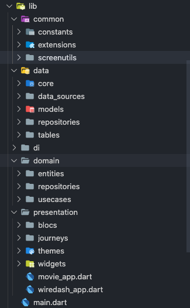

# blocbuster

A movie app built with BloC and Clean Architecture

## App working

[Youtube](https://youtu.be/BCd5QJAnq8k)

## Clean Architecture

> Independent of Frameworks. The architecture does not depend on the existence of some library of feature laden software. This allows you to use such frameworks as tools, rather than having to cram your system into their limited constraints.

> Testable. The business rules can be tested without the UI, Database, Web Server, or any other external element.

> Independent of UI. The UI can change easily, without changing the rest of the system. A Web UI could be replaced with a console UI, for example, without changing the business rules.

> Independent of Database. You can swap out Oracle or SQL Server, for Mongo, BigTable, CouchDB, or something else. Your business rules are not bound to the database.

> Independent of any external agency. In fact your business rules simply don’t know anything at all about the outside world.

[Extracted from Clean Coders Website](https://blog.cleancoder.com/uncle-bob/2012/08/13/the-clean-architecture.html)

## Core Concepts

### Dependency injection

> dependency injection is a technique in which an object receives other objects that it depends on. These other objects are called dependencies. In the typical "using" relationship the receiving object is called a client and the passed (that is, "injected") object is called a service.

In this project dependency injection is achieved by using [GetIt](https://pub.dev/packages/get_it)

## Folder Structure

## BloC - (Business Logic Component)

Bloc makes it easy to separate presentation from business logic, making your code _fast_, _easy to test_, and _reusable_.

When building production quality applications, managing state becomes critical.

As developers we want to:

know what state our application is in at any point in time.
easily test every case to make sure our app is responding appropriately.
record every single user interaction in our application so that we can make data-driven decisions.
work as efficiently as possible and reuse components both within our application and across other applications.
have many developers seamlessly working within a single code base following the same patterns and conventions.
develop fast and reactive apps.
Bloc was designed to meet all of these needs and many more.

There are many state management solutions and deciding which one to use can be a daunting task. There is no one perfect state management solution! What's important is that you pick the one that works best for your team and your project.

Bloc was designed with three core values in mind:

Simple: Easy to understand & can be used by developers with varying skill levels.
Powerful: Help make amazing, complex applications by composing them of smaller components.
Testable: Easily test every aspect of an application so that we can iterate with confidence.
Overall, Bloc attempts to make state changes predictable by regulating when a state change can occur and enforcing a single way to change state throughout an entire application.

[Extracted from bloclibrary website](https://bloclibrary.dev/#/)

## Dependencies

- [cached_network_image](https://pub.dev/packages/cached_network_image)
- [dartz](https://pub.dev/packages/dartz)
- [equatable](https://pub.dev/packages/equatable)
- [flutter_bloc](https://pub.dev/packages/flutter_bloc)
- [flutter_svg](https://pub.dev/packages/flutter_svg)
- [get_it](https://pub.dev/packages/get_it)
- [google_fonts](https://pub.dev/packages/google_fonts)
- [hive](https://pub.dev/packages/hive)
- [path_provider](https://pub.dev/packages/path_provider)
- [http](https://pub.dev/packages/http)
- [wiredash](https://pub.dev/packages/wiredash)
- [youtube_player_flutter](https://pub.dev/packages/youtube_player_flutter)
